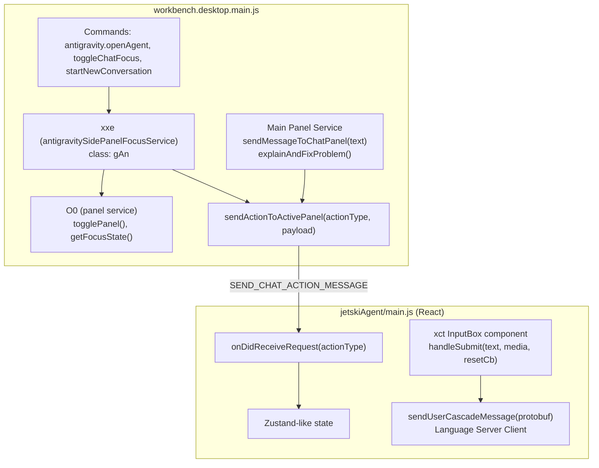

# Research: Antigravity Chat Auto-Start via Bundle Patching

> Reverse-engineering results for programmatically triggering chat messages in Antigravity IDE.

## Bundle File Map

| File | Size | Role |
|------|------|------|
| `vs/workbench/workbench.desktop.main.js` | 23 MB | Main workbench — commands, services, DI |
| `jetskiAgent/main.js` | 10.8 MB | React-based chat panel (webview) |
| `main.js` | 7.6 MB | Main process — no chat logic |

All files located at: `/Applications/Antigravity.app/Contents/Resources/app/out/`

---

## Architecture Overview



## Chat Submission Flow

### Path 1: VS Code Native Chat (NOT used by Antigravity's main chat)

```
workbench.action.chat.open 
  → {query, isPartialQuery: false}
  → g.setInput(query) 
  → g.acceptInput()   // VS Code's ChatWidget
```

> **Why `isPartialQuery` doesn't work**: When `isPartialQuery: true` → only `setInput()` is called, `acceptInput()` is skipped. Setting `isPartialQuery: false` *does* call `acceptInput()`, but this targets the **VS Code native chat widget**, NOT Antigravity's custom React panel.

### Path 2: Antigravity Side Panel Chat (Primary)

```
User types in xct InputBox 
  → _e(editorState) 
  → e(text, {media, comments}) 
  → $(text, extras) [parent component]
  → sendUserCascadeMessage(protobuf) 
  → Language Server
```

### Path 3: Programmatic Message Sending (Key Discovery!)

```
someService.sendMessageToChatPanel(textString)
  → constructs: [{chunk: {case: "text", value: text}}]
  → this.openPanel()
  → this.b.fire({actionType: "sendMessage", payload: [...]})
```

This is an **existing method** (offset `14556981`) that already does what we need. It:
1. Wraps text into a protobuf `uG` chunk
2. Opens the panel
3. Fires a `sendMessage` event

---

## Discovered Action Types

### Actions dispatched FROM workbench TO jetskiAgent:

| Action Type | Description |
|-------------|-------------|
| `startNewConversation` | Starts a fresh conversation |
| `codeBlockMention` | Attaches code selection to chat |
| `toggleFocus` | Focuses the chat input |
| `setCascadeId` | Sets the active cascade ID |
| `explainAndFixProblem` | Sends problem context + triggers explain |
| `sendMessage` | **Sends a text message** (used by `sendMessageToChatPanel`) |

### Actions handled BY jetskiAgent via `onDidReceiveRequest`:

| Action | Handler |
|--------|---------|
| `openConversationView` | Opens conversation |
| `openFolder` | Opens folder |
| `startNewConversation` | Creates new conversation via Zustand dispatch |
| `updateSourceControlInProgress` | Updates source control status |
| `getTraceJson` | Returns trace JSON |
| `showMessage` | Shows dialog message |

---

## Key Services (DI identifiers)

| Minified | Service ID | Purpose |
|----------|-----------|---------|
| `xxe` | `antigravitySidePanelFocusService` | Focus/trigger chat, send actions |
| `O0` | Panel toggle service | `togglePanel()`, `getFocusState()` |
| `Npe` | Side panel reference | Has `sendChatAction` method |
| `Bc` | Command constants | `SEND_CHAT_ACTION_MESSAGE`, etc. |

---

## Injection Strategy Recommendations

### Strategy A — Patch `sendMessageToChatPanel` trigger (⭐ Recommended)

**Target**: `workbench.desktop.main.js`  
**Approach**: Inject workspace-open hook that calls `sendMessageToChatPanel`  

1. Find a workspace activation callback (e.g., after file watchers / extensions activate)
2. Check for `MISSION.md` in workspace root via filesystem API
3. If found, call `sendMessageToChatPanel("Please read @MISSION.md and start working on the objective described in it.")`

**Structural regex pattern** for finding `sendMessageToChatPanel`:
```
sendMessageToChatPanel(<param>){
    const <var>=[es(<proto>,{chunk:{case:"text",value:<param>}})];
    this.openPanel(),
    this.b.fire({actionType:"sendMessage",payload:<var>.map(...)})
}
```

**Pros**: Clean, uses existing API, reliable  
**Cons**: Need to find the right service instance + timing

### Strategy B — Add new `onDidReceiveRequest` handler for auto-start

**Target**: `jetskiAgent/main.js`  
**Approach**: Add a `autoStartFromMission` handler in the React panel  

1. Register: `onDidReceiveRequest("autoStartFromMission")(handler)`  
2. Handler calls `handleSubmit` with the mission prompt text
3. Dispatch from workbench via `SEND_CHAT_ACTION_MESSAGE`

**Pros**: Fits Antigravity's existing architecture  
**Cons**: Requires patching both files

### Strategy C — Patch workspace startup in the main panel service

**Target**: `workbench.desktop.main.js`  
**Approach**: Find the panel service constructor and add a delayed auto-start

1. Find the class containing `sendMessageToChatPanel` (by structural match)
2. In the constructor or an `onDidOpenWorkspace` handler, add:
   ```js
   setTimeout(async () => {
       const fs = this.fileService || this.XXX; // find filesystem service
       const root = this.workspaceService.getWorkspace().folders[0];
       if (root) {
           const missionUri = root.uri.with({path: root.uri.path + '/MISSION.md'});
           try {
               await fs.stat(missionUri);
               this.sendMessageToChatPanel("Please read @MISSION.md and start working on the objective described in it.");
           } catch (e) { /* no MISSION.md, skip */ }
       }
   }, 5000);
   ```

**Pros**: Self-contained, single file patch  
**Cons**: Timing-sensitive, needs filesystem service access

---

## DevTools PoC (Manual Console Test)

To manually test the `sendMessage` action from DevTools (`Help → Toggle Developer Tools`):

```js
// Step 1: Find the panel service instance
// The panel service fires events on this.b — look for instances with sendMessageToChatPanel
// In DevTools console, you can try:

// Method A: Execute command directly
const cs = require('vs/platform/commands/common/commands');
cs.CommandsRegistry.executeCommand('antigravity.sendChatActionMessage', {
    actionType: 'sendMessage',
    payload: [/* protobuf encoded text chunk */]
});

// Method B: If you can get the service instance, call directly:
// service.sendMessageToChatPanel("Read MISSION.md and start working");
```

> Note: protobuf encoding may be required. The `es()` function creates protobuf instances, and `fie()` serializes them. These would need to be found in scope.

---

## better-antigravity Reference

### Their Pattern Matching Approach

1. **Structural regex** — match code shape, not variable names
2. **Context extraction** — read ~3000 chars around match to find variable names
3. **Frequency analysis** — find minified `useEffect` alias by counting usage patterns
4. **Safety markers** — `/*BA:autorun*/` prefix prevents double-patching
5. **Backups** — `.ba-backup` files, `--revert` support

### Key Differences for Our Challenge

| Aspect | better-antigravity (auto-run) | Our task (auto-chat) |
|--------|-------------------------------|---------------------|
| Target | Missing `useEffect` in step renderer | Missing workspace-open → chat submit |
| Files | Both bundles (same component) | Primarily `workbench.desktop.main.js` |
| Injection | After `onChange` handler | After panel service initialization or workspace open |
| Complexity | Add 1 hook call | Need filesystem check + delayed action |

---

## Next Steps

1. **PoC via DevTools**: Manually call `sendMessageToChatPanel` or fire `sendMessage` action from console
2. **Write structural regex**: Match `sendMessageToChatPanel` by shape  
3. **Find workspace open timing**: Identify where to hook the auto-start check
4. **Build patcher script**: Following better-antigravity's `patch.js` pattern
5. **Test**: Apply to copy of bundle, verify auto-submission works
6. **Integrate into lumi-ops**: Add as CLI command or extension capability

---

## Maintenance Considerations

- **Antigravity updates** may change minified variable names → structural matching mitigates
- **Protocol changes** (protobuf schema) could break `sendMessage` payload format
- **Panel service refactoring** could move `sendMessageToChatPanel` → grep for `sendMessage.*actionType` pattern
- **New action types** may supersede custom patching if Antigravity adds native auto-start
