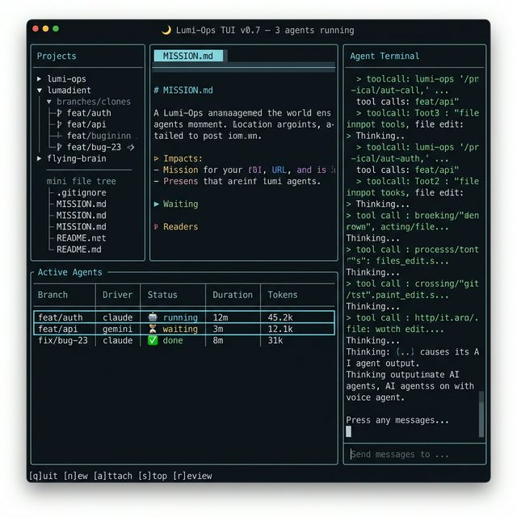

# Lumi-Ops TUI — Design Document

> AI Agent 指揮中心，活在你的 terminal 裡。



---

## Vision

一個跨專案的 **Agent Workflow TUI**，整合 worktree isolation、mission protocol、review lifecycle、即時互動。不是 tmux wrapper，是 protocol-native dashboard。

**核心突破：完全去掉「自己開 clone」這件事。** 使用者在左邊選專案、按 `n` 描述任務、選 driver，Lumi-Ops 自動 spawn + launch，agent 就出現在列表。

---

## Layout — 四區設計

```
┌─────────────┬────────────────────────┬──────────────────────┐
│             │   📄 MISSION.md 預覽   │                      │
│  Projects   │   (選到的 clone 任務)  │   Agent Terminal     │
│  Registry   │                        │   (預設: Main Agent) │
│             ├────────────────────────┤                      │
│ ▸ lumi-ops  │ Active Agents          │   即時看 agent 在    │
│ ▾ lumadient │ ┌──────┬──────┬──────┐ │   幹什麼、tool calls │
│   feat/auth │ │ auth │claude│🤖 12m│ │                      │
│   feat/api  │ │ api  │gemini│⏳  3m│ │   底部: 輸入框       │
│   fix/bug23 │ │ bug  │claude│✅  8m│ │   可以跟 agent 溝通  │
│             │ └──────┴──────┴──────┘ │                      │
├─────────────┴────────────────────────┴──────────────────────┤
│ [q]uit [n]ew [a]ttach [s]top [r]eview [d]iff [m]erge       │
└─────────────────────────────────────────────────────────────┘
🌙 Lumi-Ops TUI v0.7 — 3 agents running | lumadient (main)
```

### Panel 詳細規格

#### 左 — Projects Panel (~20%)
- 從 `~/.lumi-ops/.registry.json` 讀取所有已註冊 repo
- 樹狀展開：Repo → active clones (branches)
- 每個 clone 顯示 ReviewStatus 小圖示 (🟡 todo / 🔵 inProgress / 🟣 needsReview / ✅ done)
- 選擇 repo 切換 context，選擇 clone 更新中間兩個 panel

#### 中上 — File Viewer (~40% width, ~40% height)
- 預設顯示選中 clone 的 `MISSION.md`
- 可切換到 `MISSION_COMPLETE.md`、`REVIEW_FEEDBACK.md`
- Markdown syntax highlighting
- Tab bar 顯示檔名

#### 中下 — Active Agents (~40% width, ~60% height)
- 列表所有 clone 的 agent 狀態
- 欄位：Branch | Driver | Status | Duration | Tokens | Cost
- Status icons：🤖 running / ⏳ waiting / ✅ completed / ❌ failed / 💤 idle
- 選取某個 agent → 右邊 panel 切換到該 agent 的 terminal output
- 支持排序、篩選

#### 右 — Agent Terminal (~40%)
- 預設：Main Agent (root workspace 裡的 strategist agent)
- 選取 clone agent 後：顯示該 agent 的 tmux pane output (via `tmux capture-pane`)
- 底部輸入框：可以 send-keys 到 agent 的 tmux session
- 自動滾動 + 手動捲動模式切換

### Keyboard Shortcuts

| Key | Action |
|-----|--------|
| `q` | Quit |
| `n` | New clone (spawn + driver selection + auto launch) |
| `a` | Attach to selected agent's tmux session (全螢幕) |
| `s` | Stop selected agent |
| `r` | Set status to needsReview / view review |
| `d` | Show diff (review_clone output) |
| `m` | Merge selected clone |
| `k` | Kill selected clone |
| `Tab` | Cycle focus between panels |
| `1-4` | Jump to panel |
| `/` | Fuzzy search across all clones |
| `?` | Help overlay |

---

## Architecture

```
┌─────────────────────────────────────────────────────┐
│                  Data Layer (Files)                  │
│  .lumi-metadata.json  |  agent-status.json          │
│  MISSION.md           |  MISSION_COMPLETE.md        │
│  ~/.lumi-ops/.registry.json                         │
└──────┬──────────────┬──────────────┬────────────────┘
       │              │              │
  ┌────▼────┐   ┌─────▼─────┐  ┌────▼────┐
  │ VS Code │   │    TUI    │  │  MCP    │
  │Extension│   │  (Rust)   │  │ Server  │
  └─────────┘   └───────────┘  └─────────┘
       │              │              │
       └──────────────┼──────────────┘
                      │
              ┌───────▼───────┐
              │  lumi-ops CLI │  ← 唯一 mutation 源
              └───────────────┘
```

- **TUI 是純 consumer** — 讀 file-based state，不直接操作 git
- **所有 mutation** (spawn/kill/merge/launch) **透過 `lumi-ops` CLI subprocess**
- **tmux 互動**透過 `tmux capture-pane` (讀) 和 `tmux send-keys` (寫)
- **Polling loop**: 每 2s 重新讀 metadata + agent-status，更新 UI

### 目錄結構

```
packages/tui/
├── doc/                    # Design docs & mockups
│   ├── design.md           # ← 這份文件
│   └── tui-mockup.png
├── src/
│   ├── main.rs             # Entry point, event loop
│   ├── app/                # App state, actions, keybindings
│   ├── protocol/           # Lumi Protocol Parser
│   │   ├── metadata.rs     # Parse .lumi-metadata.json
│   │   ├── agent_status.rs # Parse agent-status.json
│   │   ├── mission.rs      # Parse MISSION.md / MISSION_COMPLETE.md
│   │   └── registry.rs     # Parse ~/.lumi-ops/.registry.json
│   ├── tmux/               # tmux capture-pane, send-keys, session mgmt
│   ├── cli/                # Subprocess calls to `lumi-ops` CLI
│   └── ui/                 # ratatui panels
│       ├── projects.rs     # 左 panel
│       ├── file_viewer.rs  # 中上 panel
│       ├── agent_list.rs   # 中下 panel
│       ├── terminal.rs     # 右 panel
│       └── status_bar.rs   # 底部快捷鍵列
├── Cargo.toml
└── README.md
```

### 可獨立拆出

`protocol/` 模組未來可獨立成 `lumi-protocol` crate，讓其他工具 (Grove, Pertmux) 也能讀取 Lumi-Ops 的 file-based protocol。

---

## Tech Stack

| 元件 | 選型 | 原因 |
|------|------|------|
| 語言 | **Rust** | 市場主流 (Grove/Pertmux/AoE 都用 Rust)；TUI 需要低延遲渲染 |
| TUI 框架 | **ratatui** | Rust TUI 生態的事實標準，取代了 tui-rs |
| Async | **tokio** | tmux subprocess + file watch + polling 需要 async |
| Git | **git2** | 直接讀 git 狀態，不需要 subprocess |
| 序列化 | **serde + serde_json** | 解析 metadata JSON |
| Markdown | **pulldown-cmark** | 解析 MISSION.md 用於渲染 |
| Terminal | **crossterm** | 跨平台 terminal backend for ratatui |

---

## Open Source 參考 — 可直接借用的程式碼

### 🥇 Grove (ZiiMs/Grove) — 最值得參考

| | |
|---|---|
| **Repo** | https://github.com/ZiiMs/Grove |
| **License** | MIT ✅ 可自由使用 |
| **Tech** | Rust + ratatui + tokio + git2 + tmux |

**可借用的模組：**
- `src/agent/` — Agent status detection (regex patterns for Claude/Gemini/Codex output)
- `src/tmux/` — tmux session management (create, attach, capture-pane, send-keys)
- `src/ui/` — ratatui component patterns (list with preview panel, keybinding system)
- `src/storage/` — Session persistence across restarts
- `src/git/` — Git worktree operations via git2

**差異化要點（Grove 沒有，我們要加的）：**
- MISSION.md protocol 解析 & 渲染
- Multi-repo registry 支援
- Review lifecycle UI (status transitions + REVIEW_FEEDBACK.md)
- Main Agent 互動面板

---

### 🥈 Pertmux (rupert648/pertmux) — 架構參考

| | |
|---|---|
| **Repo** | https://github.com/rupert648/pertmux |
| **License** | （需確認） |
| **Tech** | Rust, Daemon/Client 架構 |

**可借用的概念：**
- **Daemon + Unix Socket 架構** — 背景 daemon 輪詢狀態，TUI client 透過 socket 連接
- **DashboardSnapshot 模式** — 把所有狀態打包成一個 snapshot 推送給 UI
- **Multi-project fuzzy finder** — 跨專案快速切換 (`f` key)
- **Agent monitoring** — 追蹤 Claude/OpenCode across tmux panes

**為什麼值得參考：**
Pertmux 的 daemon/client 架構比純 polling 更優雅。如果 TUI 要支持多個 client 同時連接（比如 VS Code extension 也能透過 socket 讀狀態），這個模式很值得學。

---

### 🥉 Agent of Empires (agent-of-empires) — tmux + Docker 參考

| | |
|---|---|
| **Repo** | https://github.com/nathanbrake/agent-of-empires |
| **License** | （需確認） |
| **Tech** | Rust, tmux-based |

**可借用的模組：**
- Docker sandboxing 整合 — 如果未來要加安全隔離
- Auto git worktree 管理
- Session status detection patterns

---

### 其他值得掃一眼的

| 工具 | Repo | 要看什麼 |
|------|------|----------|
| **AgentPipe** | github.com/kevinelliott/agentpipe | Inter-agent communication "rooms" 概念 |
| **workmux** | github.com/raine/workmux | 最簡化的 worktree + tmux TUI，看 minimal viable 怎麼做 |
| **lazyworktree** | github.com/chmouel/lazyworktree | CI/PR status 整合, agent sessions pane |
| **TmuxCC** | github.com/nyanko3141592/tmuxcc | Approval management UI (類似 review protocol) |
| **Ban Kan** | 搜 ban-kan | Kanban pipeline UI for agents (Backlog→Planning→Impl→Review→Done) |
| **claude-dashboard** | github.com/seunggabi/claude-dashboard | k9s-inspired TUI design patterns |
| **agent-deck** | github.com/asheshgoplani/agent-deck | Cost tracking per agent |

### Rust TUI 生態工具

| Crate | 用途 |
|-------|------|
| **ratatui** | TUI 框架 (github.com/ratatui-org/ratatui) |
| **tui-textarea** | 輸入框元件 (for agent 溝通輸入) |
| **tui-scrollview** | 可捲動的 log viewer |
| **tui-tree-widget** | 樹狀結構 (for projects panel) |
| **syntect** | Syntax highlighting (for markdown/code 渲染) |
| **fuzzy-matcher** | Fuzzy search (for `/` 搜尋功能) |

---

## Competitive Positioning

```
                    Protocol Depth
                         ▲
                         │
                   Lumi TUI ★
                     (目標)
                         │
              Ban Kan •  │
                         │
     TmuxCC •            │
                         │
   ──────────────────────┼──────────────────── Surface Richness ▶
                         │
         workmux •       │  • Grove
                         │  • Pertmux
       AoE •             │
                         │     • Kilt (Desktop)
                         │
```

**X 軸**: UI 豐富度 (panels, integrations, features)
**Y 軸**: Protocol 深度 (structured task → review → merge lifecycle)

**Lumi TUI 的目標位置：右上角** — 既有豐富的 UI，又有深度的 protocol 支持。目前沒有任何工具佔據這個位置。

---

## Phase 1 Scope (4-6 weeks)

**只做 read-only dashboard + basic actions:**

- [ ] Rust 專案 scaffold (Cargo.toml, main.rs, ratatui boilerplate)
- [ ] Protocol parser: 讀 `.lumi-metadata.json` + `agent-status.json` + registry
- [ ] Left panel: Projects tree (from registry)
- [ ] Center-bottom: Agent list table (branch, driver, status, duration)
- [ ] Center-top: MISSION.md viewer (raw markdown)
- [ ] Right panel: Agent terminal output (tmux capture-pane)
- [ ] Status bar with keyboard shortcuts
- [ ] Basic actions: `n` (spawn via CLI), `a` (attach), `s` (stop), `k` (kill)
- [ ] 2-second polling loop for state refresh

**Phase 1 不做：**
- Inter-agent communication
- Project management 整合
- Cost tracking
- Web dashboard
- Daemon/client 架構 (先用直接 file read)
